# DfE Sign-in Integration

This document explains how the application integrates with DfE Sign-in for authentication and authorization, including how user roles are fetched from the DfE Sign-in Public API.

## Overview

The application uses two DfE Sign-in services:

1. **OpenID Connect (OIDC)** - For user authentication
2. **Public API** - For fetching user roles and permissions


## Authentication Flow

### Step 1: OIDC Authentication

When a user accesses the application, they are redirected to DfE Sign-in for authentication. Upon successful login, DfE Sign-in returns claims containing:

- **User Information**: ID, email, first name, surname
- **Organisation Information**: ID, name, category (e.g., "Local Authority")


### Step 2: Role Authorization via Public API

**Important**: User roles are NOT included in the OIDC token claims when using the `code` response type. Roles must be fetched separately from the DfE Sign-in Public API.


## Configuration

### Required Settings

Add the following to your `appsettings.json` or environment-specific settings:

```json
{
  "DfeSignIn": {
    "Authority": "https://oidc.signin.education.gov.uk",
    "MetaDataUrl": "https://oidc.signin.education.gov.uk/.well-known/openid-configuration",
    "ClientId": "<your-client-id>",
    "ClientSecret": "<your-client-secret>",
    "APIServiceProxyUrl": "https://api.signin.education.gov.uk",
    "APIServiceSecret": "<your-api-secret>",
    "CallbackUrl": "/auth/cb",
    "SignoutCallbackUrl": "/home/index",
    "SignoutRedirectUrl": "/",
    "Scopes": [
      "openid",
      "email",
      "profile",
      "organisation"
    ],
    "CookieName": "sa-login",
    "CookieExpireTimeSpanInMinutes": 5,
    "GetClaimsFromUserInfoEndpoint": true,
    "SaveTokens": true,
    "SlidingExpiration": true
  }
}
```

### Environment URLs

| Environment | OIDC Authority | API URL |
|-------------|----------------|---------|
| Test | `https://test-oidc.signin.education.gov.uk` | `https://test-api.signin.education.gov.uk` |
| Production | `https://oidc.signin.education.gov.uk` | `https://api.signin.education.gov.uk` |

### Secrets

There are **two different secrets** required:

| Secret | Purpose | Where to find |
|--------|---------|---------------|
| `ClientSecret` | OIDC authentication | DfE Sign-in console → Service Configuration → Client secret |
| `APIServiceSecret` | Public API authentication | DfE Sign-in console → Service Configuration → API secret |

> ⚠️ **Important**: These are different values. Make sure you copy the correct secret for each purpose.

## Code Architecture

### Key Components


### File Locations

| File | Purpose |
|------|---------|
| `Infrastructure/DfeSignInExtensions.cs` | OIDC setup and claims extraction |
| `Infrastructure/DfeSignInApiService.cs` | Public API integration for roles |
| `Infrastructure/IDfeSignInApiService.cs` | API service interface |
| `Infrastructure/IDfeSignInConfiguration.cs` | Configuration interface |
| `Infrastructure/DfeSignInConfiguration.cs` | Configuration implementation |
| `Domain/DfeSignIn/DfeClaims.cs` | Claims model (user, org, roles) |
| `Domain/DfeSignIn/Role.cs` | Role model |
| `Domain/DfeSignIn/ClaimConstants.cs` | Claim type constants |

## Authorization Logic

The `HomeController.Index` method implements the following authorization checks:


### Required Role

The application requires users to have the `mefcsLocalAuthority` role code assigned in DfE Sign-in.

## JWT Token Generation for API

The Public API requires a JWT bearer token signed with the API secret:

```csharp
// Token structure
{
  "iss": "<client-id>",           // Your service's Client ID
  "aud": "signin.education.gov.uk", // Fixed audience
  "iat": 1733843721,               // Issued at (Unix timestamp)
  "exp": 1733844021                // Expires (Unix timestamp, +5 mins)
}
```

The token is signed using **HMAC-SHA256** with the API secret as the key.

## API Endpoint

### Get User Roles

```
GET {APIServiceProxyUrl}/services/{clientId}/organisations/{organisationId}/users/{userId}
```

**Headers:**
```
Authorization: Bearer <jwt-token>
```

**Response:**
```json
{
  "userId": "C1F3A68B-F487-4895-9508-DC11DA29C567",
  "serviceId": "ManageEligibilityForChildcareSupport",
  "organisationId": "d30e3bf7-9116-4243-989c-d20cc063dab2",
  "roles": [
    {
      "id": "22440",
      "name": "MEFCS - Local Authority Role",
      "code": "mefcsLocalAuthority",
      "numericId": "22440",
      "status": {
        "id": 1
      }
    }
  ]
}
```

## Troubleshooting

### Common Issues

| Error | Cause | Solution |
|-------|-------|----------|
| `403 Forbidden - invalid signature` | Wrong API secret or Client ID | Verify `APIServiceSecret` and `ClientId` match DfE Sign-in console |
| `403 Forbidden` | API secret vs Client secret confusion | Ensure you're using the **API secret**, not the Client secret |
| Empty roles | API not configured | Check service has API access enabled in DfE Sign-in |
| `UnauthorizedOrganization` view | User's org is not a Local Authority | User must belong to a Local Authority organisation |
| `UnauthorizedRole` view | User missing required role | Assign `mefcsLocalAuthority` role to user in DfE Sign-in |

### Debugging

Enable debug logging to see API calls:

```json
{
  "Logging": {
    "LogLevel": {
      "CheckChildcareEligibility.Admin.Infrastructure.DfeSignInApiService": "Debug"
    }
  }
}
```

This will log:
- The API URL being called
- The API response (including roles)
- Any errors encountered

## References

- [DfE Sign-in Help](https://help.signin.education.gov.uk/)
- [DfE Sign-in Service Configuration](https://manage.signin.education.gov.uk/)
- [OpenID Connect Specification](https://openid.net/connect/)

---

## Appendix: The Hotel Analogy

To understand how DfE Sign-in works with our application, imagine a luxury hotel with multiple facilities and services.

### The Players

| Technical Term | Hotel Analogy |
|----------------|---------------|
| **User** | Guest arriving at the hotel |
| **DfE Sign-in** | The hotel's front desk / reception |
| **Our Application** | A restaurant inside the hotel |
| **ClientId** | The restaurant's business license number |
| **ClientSecret** | The secret handshake between the restaurant and front desk |
| **APIServiceSecret** | The restaurant manager's master key |
| **ID Token** | Guest's hotel key card |
| **JWT Bearer Token** | Signed request letter from the restaurant manager |
| **Organisation (LA)** | The guest's company/employer |
| **Role** | The guest's job title/access level |

### The Journey

```mermaid
sequenceDiagram
    autonumber
    participant Guest as 🧑 Guest
    participant FrontDesk as 🏨 Front Desk<br/>(DfE Sign-in)
    participant Restaurant as 🍽️ Restaurant<br/>(Our App)
    participant BackOffice as 📋 Back Office<br/>(DfE API)

    Note over Guest,Restaurant: Phase 1: Check-in (Authentication)
    Guest->>Restaurant: I'd like to dine here
    Restaurant->>FrontDesk: Please verify this guest<br/>(with my business license)
    FrontDesk->>Guest: Please show your ID
    Guest->>FrontDesk: Here are my credentials
    FrontDesk->>FrontDesk: Verify identity
    FrontDesk->>Guest: Here's your key card<br/>(ID Token)
    Guest->>Restaurant: Here's my hotel key card

    Note over Restaurant,BackOffice: Phase 2: Authorization Check
    Restaurant->>Restaurant: Read key card:<br/>Guest from "LocalAuthority Ltd"
    Restaurant->>BackOffice: What's this guest's access level?<br/>(signed letter from manager)
    BackOffice->>BackOffice: Verify manager's signature
    BackOffice->>Restaurant: Guest has "VIP Dining" access

    Note over Guest,Restaurant: Phase 3: Access Decision
    alt Has Required Access
        Restaurant->>Guest: Welcome! Right this way...
    else No Access
        Restaurant->>Guest: Sorry, this area is restricted
    end
```



### How It Works

#### Step 1: Guest Arrives (User clicks "Sign in")
Just like a guest walking up to a hotel restaurant, the user tries to access our application. The restaurant (our app) can't verify guests directly—they must go through the front desk.

#### Step 2: Front Desk Verification (OIDC Authentication)
The restaurant sends the guest to the front desk with their business license number (`ClientId`). This proves to the front desk that the restaurant is a legitimate partner. The front desk asks the guest for credentials (username/password), verifies them, and issues a key card (ID Token).

```csharp
// The key card contains basic guest info
var claims = new DfeClaims
{
    FirstName = "John",           // Guest's name
    LastName = "Smith",
    Email = "john@authority.gov", // Contact details
    UserId = "abc-123",           // Unique guest ID
    OrganisationId = "org-456",   // Which company they work for
    OrganisationName = "Local Authority Ltd"
};
```

#### Step 3: Checking Guest's Access Level (API Role Fetch)
The key card tells us WHO the guest is and WHICH COMPANY they represent, but not WHAT ACCESS LEVEL they have. To find this out, the restaurant manager writes a signed letter (JWT token) to the back office:

```
"Dear Back Office,
 I'm the manager of Restaurant ABC (iss: ClientId)
 Please tell me about guest abc-123 from company org-456
 Signed at: 10:30 AM today
 Valid until: 10:40 AM
 — Manager (signed with APIServiceSecret)"
```

The back office verifies the manager's signature and responds:

```json
{
  "roles": [
    { "code": "mefcsLocalAuthority", "name": "VIP Dining Access" }
  ]
}
```

#### Step 4: Access Decision
Now the restaurant knows:
- ✅ The guest is who they say they are (authenticated)
- ✅ They work for a valid company (organisation check)
- ✅ They have VIP access level (role check)

The guest is welcomed to their table! 🎉

### Why Two Secrets?

```mermaid
flowchart LR
    subgraph Secrets["🔐 Two Different Secrets"]
        CS["ClientSecret<br/>───────────<br/>Proves our app is<br/>legitimate to DfE Sign-in<br/>during login"]
        AS["APIServiceSecret<br/>───────────<br/>Signs our requests<br/>to the DfE API<br/>for fetching roles"]
    end

    subgraph Usage["📝 When Used"]
        CS --> OIDC["OIDC Login Flow"]
        AS --> API["API Requests"]
    end

    style CS fill:#e1f5fe
    style AS fill:#fff3e0
```



| Secret | Hotel Analogy | Technical Purpose |
|--------|---------------|-------------------|
| **ClientSecret** | Restaurant's partnership agreement with the hotel | Used during OIDC authentication to prove our app is registered with DfE Sign-in |
| **APIServiceSecret** | Manager's signature key | Used to sign JWT tokens when calling the DfE API to fetch user roles |

### The Key Insight

Just like a hotel separates "verifying who you are" (front desk) from "checking what you can access" (back office systems), DfE Sign-in separates:

1. **Authentication** (OIDC) — "Is this person really John Smith from Local Authority Ltd?"
2. **Authorization** (API) — "What is John Smith allowed to do in our system?"

This separation of concerns provides:
- **Better security**: The ID token doesn't contain sensitive role information
- **Flexibility**: Roles can be updated without re-issuing ID tokens
- **Granularity**: Different services can have different role structures
